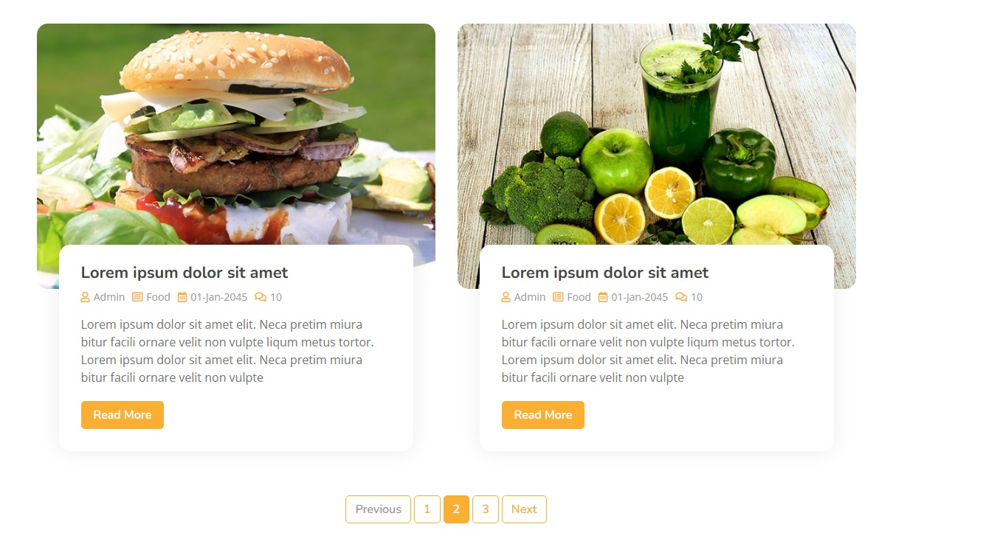
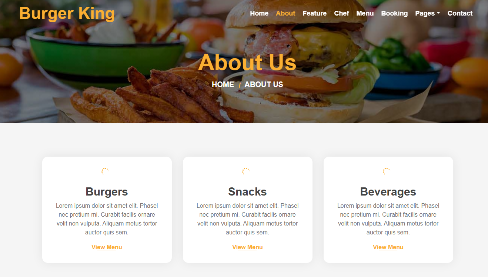

# 🍔 Burger King Django Clone

A **Django-based Burger King website clone** that simulates a modern restaurant website with menu browsing, table booking, and responsive UI.
This project demonstrates **full-stack web development using Django, HTML, CSS, and JavaScript** with a SQLite database backend.

---

## 🚀 Features

* 🍔 Restaurant landing page
* 📋 Food menu display
* 👨‍🍳 Chef section
* 📅 Table booking system
* 📩 Contact page
* 🗄 Database integration using SQLite
* 🎨 Responsive UI design
* ⚡ Django backend architecture

---

## 🛠 Tech Stack

**Frontend**

* HTML5
* CSS3
* Bootstrap
* JavaScript

**Backend**

* Python
* Django

**Database**

* SQLite

---

## 📂 Project Structure

```
Burger-King-Django-Version/
│
├── add/                 # Django app
├── static/              # CSS, JS, images
├── templates/           # HTML templates
├── manage.py
└── db.sqlite3
```

---

## ⚙️ Installation

### 1️⃣ Clone the repository

```
git clone https://github.com/shirshanag/Burger-King-Django-Version.git
```

### 2️⃣ Navigate to project folder

```
cd Burger-King-Django-Version
```

### 3️⃣ Create virtual environment

```
python -m venv venv
```

Activate environment:

Windows

```
venv\Scripts\activate
```

Linux/Mac

```
source venv/bin/activate
```

---

### 4️⃣ Install dependencies

```
pip install django
```

---

### 5️⃣ Run migrations

```
python manage.py migrate
```

---

### 6️⃣ Start the development server

```
python manage.py runserver
```

Open browser:

```
http://127.0.0.1:8000/
```

---

## 📸 Screenshots






---

## 🎯 Purpose of the Project

This project was created to:

* Practice **Django backend development**
* Learn **template rendering and static file management**
* Understand **database integration**
* Build a **restaurant-style web application**

---

## 🔮 Future Improvements

* User authentication (Login / Signup)
* Online food ordering system
* Payment gateway integration
* Admin dashboard for menu management
* REST API integration

---

## 👨‍💻 Author

**Shirsha Nag**

* Python Developer
* Machine Learning Enthusiast
* Quantum Computing Researcher

---

## ⭐ Contributing

Pull requests are welcome.
For major changes, please open an issue first to discuss what you would like to change.

---

## 📜 License

This project is for **educational purposes only**.
